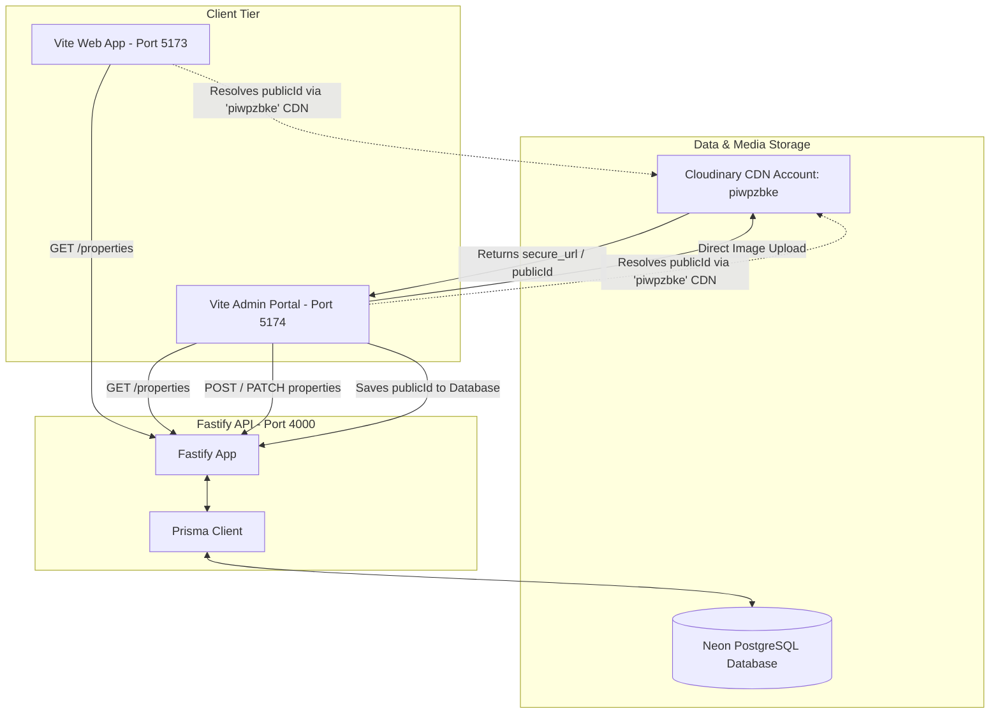

# 🏗️ Carry Construction — Architecture, Data Flow, & Backup Guide

This document explains the architecture, database layout, asset hosting, and local backup configuration of the Carry Construction codebase. It serves as a guide for subsequent AI agents to understand the system flow.

---

## 🗺️ System Architecture Flowchart



---

## 🗄️ Database Configuration & Sync (Neon PostgreSQL)

### 1. Connection Parameters
- The backend API connects to a Neon PostgreSQL instance via `DATABASE_URL` declared in [apps/api/.env](file:///Users/yashswisingh/Documents/New project/Real-Estate/apps/api/.env).
- **Environment Separation:**
  * **Development (`carry_dev`):** Local development uses the `carry_dev` database (configured in `.env`). Database pushes (`npm run prisma:push`) and seeds (`npm run seed`) should only be executed against `carry_dev`.
  * **Production (`neondb`):** The live deployed environment connects to the `neondb` database. A backup of the production configurations is stored locally in `.env.production` (which is git-ignored).
- **CRITICAL WARNING:** The production database (`neondb`) is **shared** with another external admin panel (`carry-admin-suryansh.web.app`). Under no circumstances should existing shared tables on the production database (`Agent`, `Labour`, `Shop`, `Property`, `ConstructionProject`) be altered, truncated, or dropped, as it will break the other live panel.

### 2. Marketing Tables Synchronization
- The following marketing-specific tables were created locally and synced safely using `npx prisma db push` to `carry_dev` (development) and then to `neondb` (production):
  * `leads`
  * `testimonials`
  * `materials`
  * `blog_posts`
- Because these are entirely new tables, they do not impact the existing schema accessed by the external admin panel.

### 3. Graceful Property & Project Columns Handling
- **`processStages` (ConstructionProject):** This column is **not** present in the shared database. To prevent query execution crashes, it has been removed from [schema.prisma](file:///Users/binova/Documents/Projects/Suru/Real-Estate/apps/api/prisma/schema.prisma) and is instead handled dynamically in memory inside the serialization helper ([serialize.ts](file:///Users/binova/Documents/Projects/Suru/Real-Estate/apps/api/src/lib/serialize.ts)) with sensible fallback values (Foundation, Structure, Finishing stages).

---

## 🖼️ Cloudinary Image Asset Resolution

### 1. Storage Format
- Images are uploaded to Cloudinary directly from client applications.
- Only the **public ID** (or file slug) is stored in the PostgreSQL database array `images: String[]` (e.g. `["carry_res/qyzv3n..."]`).

### 2. Resolution Key
- The primary Cloudinary account holding all listing photos is **`piwpzbke`**.
- In the admin code, dynamic asset paths must always resolve against this cloud name:
  ```typescript
  const cloudName = import.meta.env.VITE_CLOUDINARY_CLOUD_NAME ?? 'piwpzbke';
  const imageUrl = `https://res.cloudinary.com/${cloudName}/image/upload/q_auto,f_auto/${publicId}`;
  ```
- *Avoid using the API's private cloud name (`pvrehhhs`) for loading listing assets, as that accounts does not contain the production photos.*

---

## 🔓 Properties Draft & Visibility Logic

### 1. Frontend Web App Visibility
- The public site listing queries the backend at `GET /properties` which filters elements using `{ published: true }`. This ensures incomplete listings or draft items are hidden from consumers.

### 2. Admin Portal Visibility
- The Admin portal listings list also queries the backend at `GET /properties` (fetching only `{ published: true }` items by default).
- The backend Fastify controller in [properties.ts](file:///Users/binova/Documents/Projects/Suru/Real-Estate/apps/api/src/routes/properties.ts) supports `includeUnpublished=true` as a query parameter for debugging or future custom views, but the active admin listing view only lists published assets.

---

## 💾 Local JSON Backup System

Inside the admin portal's Properties page, admins can download a complete backup of all listings by clicking **"Backup JSON"**.

This triggers the client-side helper `exportJSONBackup(items: Property[])` which:
1. Iterates over every property listing.
2. Resolves all Cloudinary public IDs inside `images` to their absolute HTTPS URLs pointing to `piwpzbke`.
3. Packages the list into a self-contained JSON blob.
4. Triggers a browser download of `properties_db_backup_YYYY-MM-DD.json`.
